# DingNet User Documentation

In this file you'll find all the information needed to set up a simulation.
## How to setup/load a simulation configuration.
TODO

## How to setup a Pollutionenvironment.

First of all, a simulation configuration has to be loaded in, otherwise an error message will pop up.
 
  

See [How to setup/load a simulation configuration.](#how-to-setupload-a-simulation-configuration)

Then, two options are available. The first is loading in an already existing Pollutionenvironment file. The Second is creating your own Pollutionenvironment from scratch.

### Loading in an already existing Pollutionenvironment file.
This can be done by clicking the open button at the top of the screen.
 
  

Opening this will open the following screen:
 
  

Here you can select the file to load in, a simple file looks like this:
 
  

To add a new source/sensor it suffices to fill in all these values declared in the file.

See [Source restrictions.](#source-restrictions) to know which functions can be used in the \<function> tag.

### Creating a Pollutionenvironment file from scratch/Editing a Pollutionenvironment file.

When no configuration is loaded in a blank Pollutionenvironment is loaded in, meaning that no pollution will be generated.

Following steps count for creating and editing the pollutionenvironment.

There are two possible options to change.

#### Changing sources
The first is the sources. To do this press the Configure Sources button at the top of the screen.

 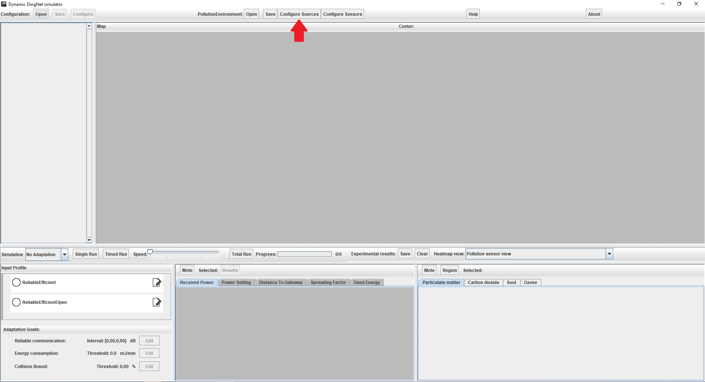 
 
This will open following screen:

 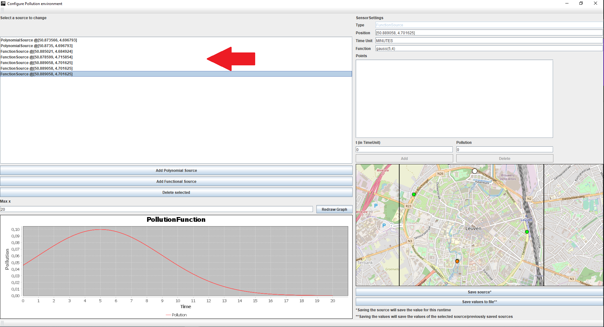 
 
In the list you are able to select a source to change. This will fill in all values and plot the graph:
 
  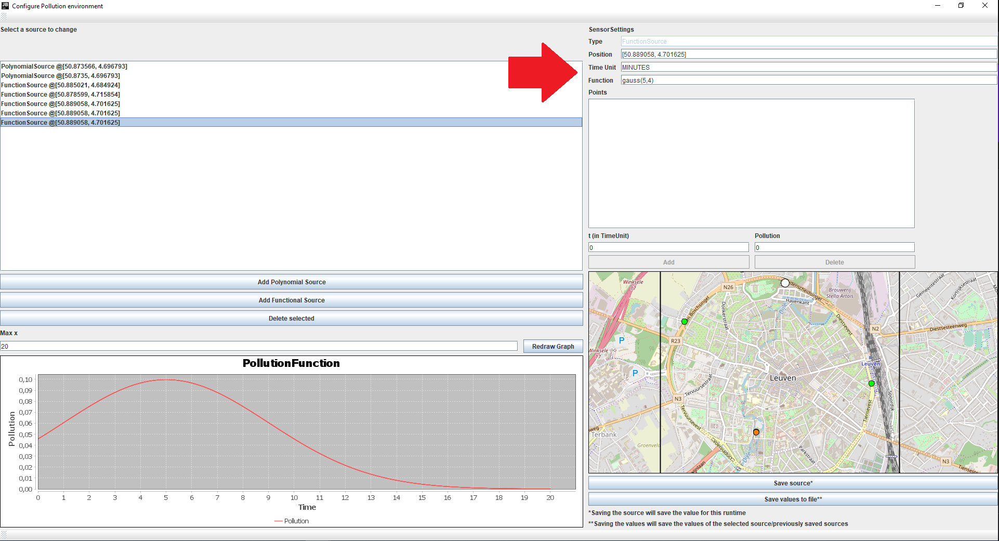 
  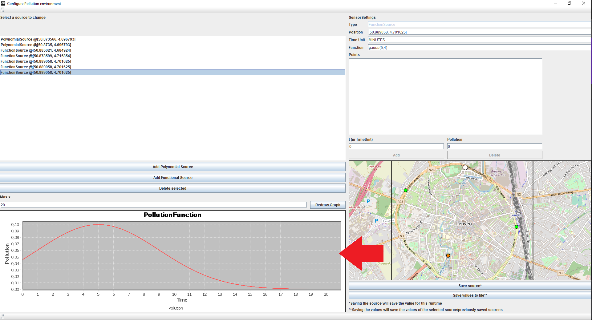 
  
All fields can be updated manually with a few restrictions, for these restrictions see [Source restrictions.](#source-restrictions).

To make it easier to set the position of the source. A map is added that, if the user clicks within the black square, updates the Position field to the corresponding position.

  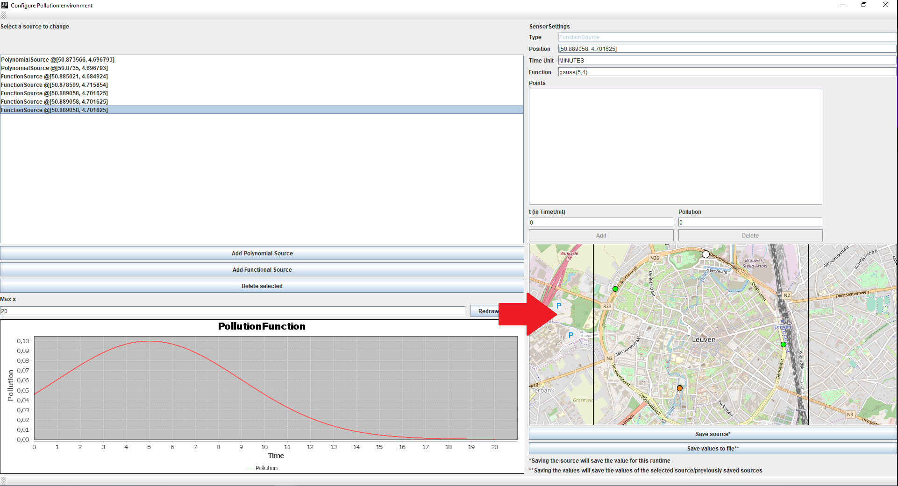 
  
Once changes are made to a source, the source needs to be saved. This can be done by pressing the Save Source button.

  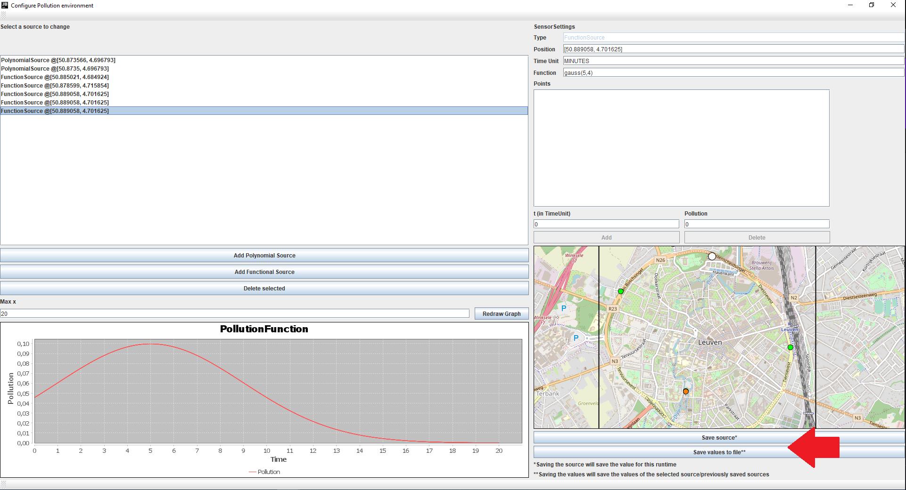 
  
This saves the source temporarily for the current runtime of the program.

If you want to save all temporary changes and current changes. Click the Save values to file button. This will save the current state of the environment to a file.

To add a source to the environment, press the Add Polynomial/Functional source button. Depending on which one you want.
  
  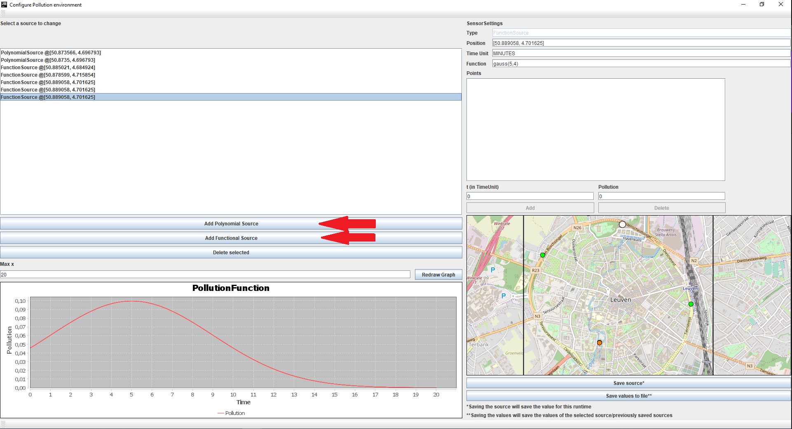 
  
This will add a blank source that can be modified by selecting it and changing the fields.

To delete a source, select the source you want to delete from the list and press the Delete selected-button.

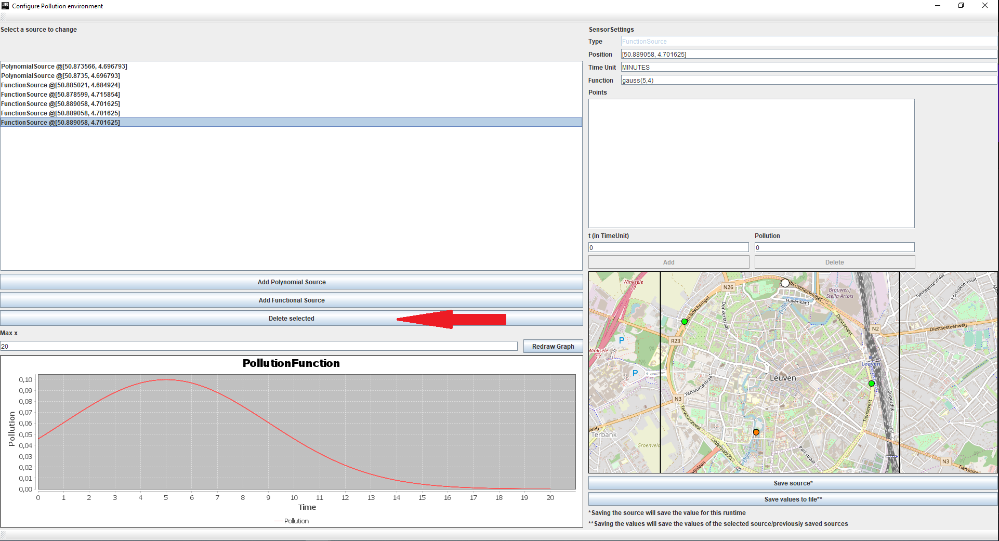 

#### Changing sensors

The second is the sensors. To do this press the Configure Sensors button at the top of the screen.

 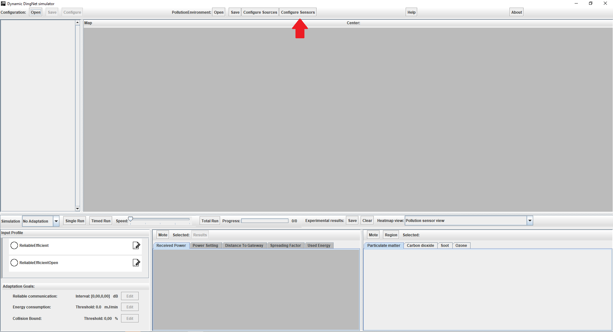 

This will open following screen:

 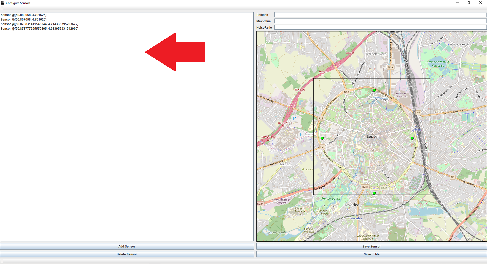 
 
In the list you are able to select a sensor to change. This will fill in all values:

 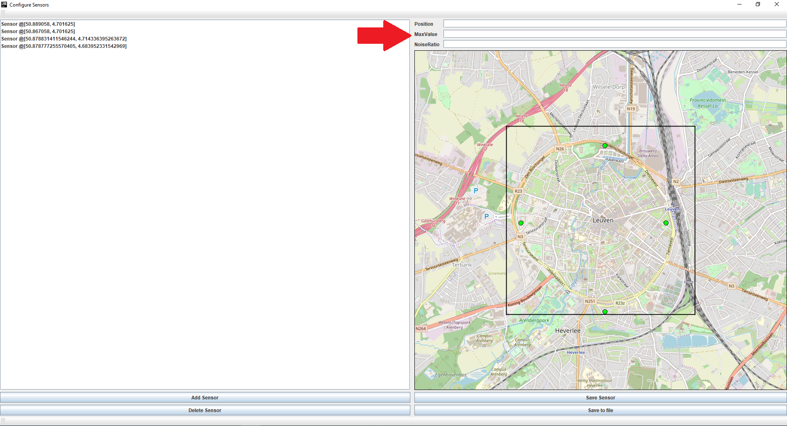 

Again as with the sources it is possible to select a position on the map to update the Position field.

Once changes are made to a sensor, the sensor needs to be saved. This can be done by pressing the Save Sensor button.

  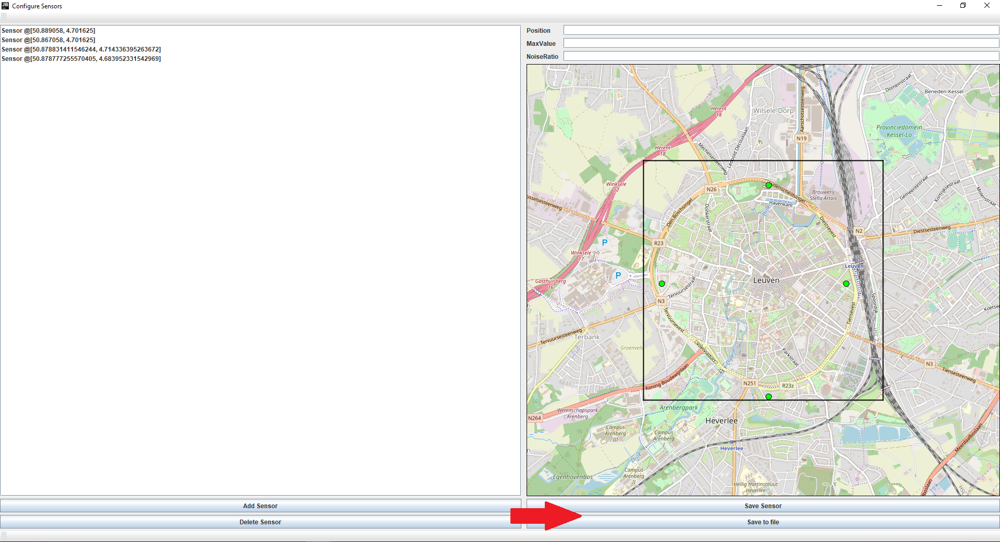 
  
This saves the sensor temporarily for the current runtime of the program.

If you want to save all temporary changes and current changes. Click the Save to file button. This will save the current state of the environment to a file.

To add a sensor to the environment, press the Add Source button.
  
  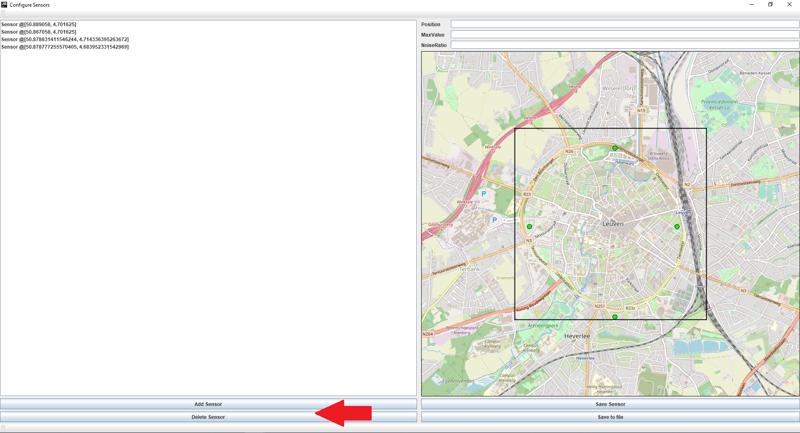 
  
This will add a blank sensor that can be modified by selecting it and changing the fields.

To delete a sensor, select the sensor you want to delete from the list and press the Delete Sensor-button.

### Saving the current environment

If the current environment of this runtime is an environment you want to keep, press Save at the top of the main screen:

  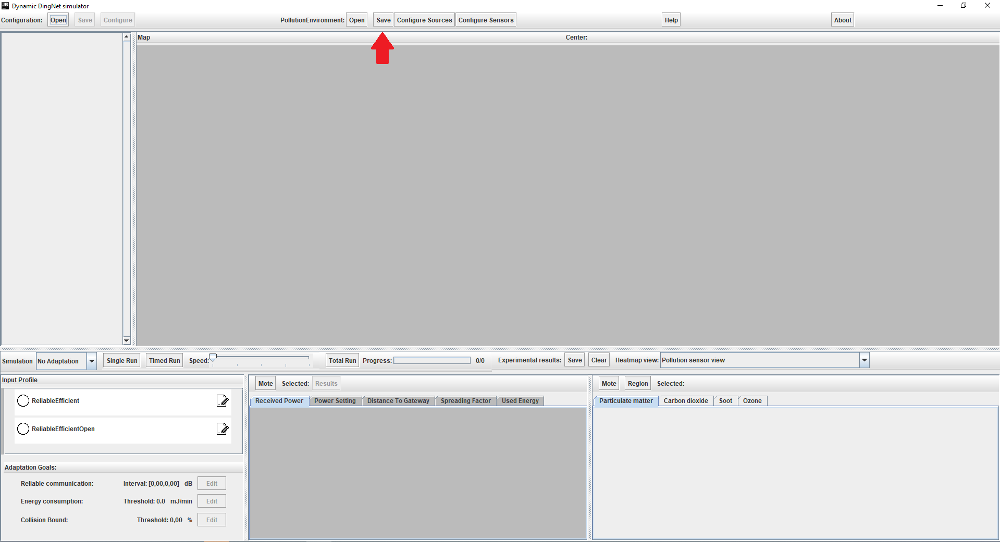 
  
This will give you the options to overwrite a file/create a new file with the current environment.

### Source restrictions

!!!Only by following these restrictions correct workings of the simulator are guaranteed!!!

A source can only have one of the following Time Units:

- HOURS
- MINUTES
- SECONDS
- MILLIS
- MICROS
- NANOS

A source can only have a function consisting out of:
- Basic operations: +, -, /, *, ^, ...
- Geometric/hyperbolic functions: sin(t), cos(t), tan(t), asin(t), acos(t), atan(t), sinh(t), cosh(t), tanh(t)
- Exponential en logarithmic functions: exp(t), log(t) (this is base 10), ln(t), gauss(mean,sd), sqrt(t), pow(t,b) (raise t to the b'th power)
- Transforms: deg(t) (convert radians to degrees), rad(t) (convert degrees to radians), abs(t) (get the absolute value), round(t) (mathematical rounding), ceil(t) (ceiling), floor(t) (flooring), sgn(t) (get sign of t)

A source its function should also be defined for the time you wish to simulate. If this is not the case. NaN values will occur (meaning the pollution will be ignored).

If the function is invalid it is possible that the graphing won't work anymore. This will be a hint of an invalid function.
