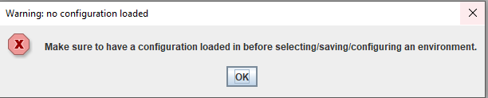
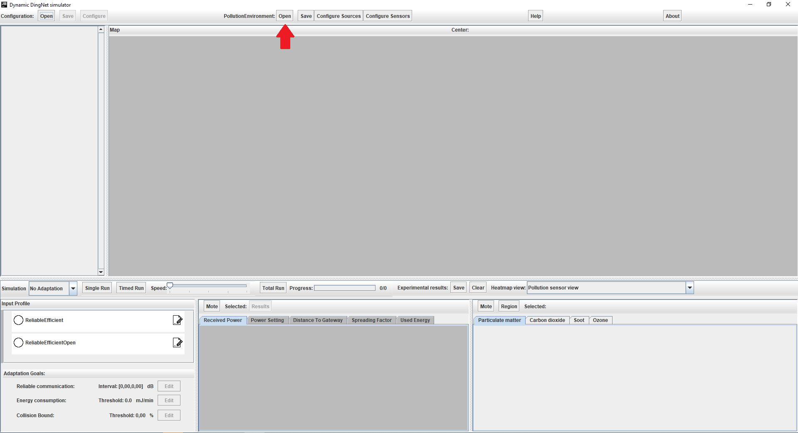
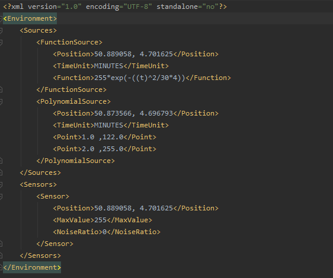

#DingNet User Documentation

In this file you'll find all the information needed to set up a simulation.
## How to setup/load a simulation configuration.
TODO

## How to setup a Pollutionenvironment.

First of all, a simulation configuration has to be loaded in, otherwise an error message will pop up.
 
  

See [How to setup/load a simulation configuration.](#How-to-setup/load-a-simulation-configuration.)

Then, two options are available. The first is loading in an already existing Pollutionenvironment file.
This can be done by clicking the open button at the top of the screen.
 
  

Opening this will open the following screen:
 
  

Here you can select the file to load in, a simple file looks like this:
 
  

To add a new source/sensor it suffices to fill in all these values declared in the file.
